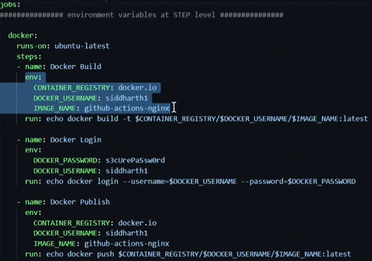
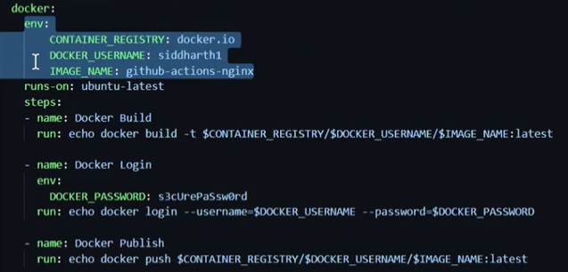
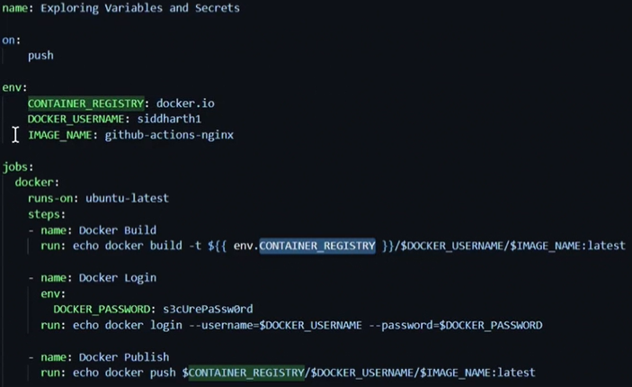

# GitHub Actions Lab 1
GitHub Actions Marketplace to search Actions for your workflow...

Downloading and Uploading Artifact is in workflow directrory...

# Step Level Environment Variable:

# Job Level Environment Variable:

# Workflow Level Environment Variable:

2 ways to call variable: 
1st => $CONTAINER_REGISTERY
2nd => ${( env.CONTAINER_REGISTERY )}
